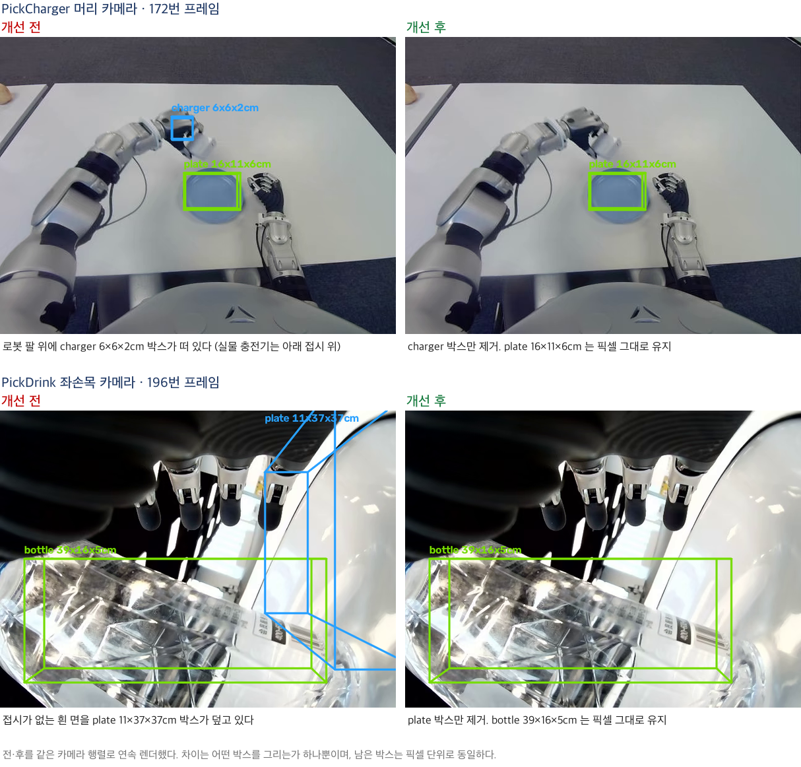

# ⑤ Ghost 현상 해결 — 진행 중 (10에피소드 재검증으로 상한 실측, 모듈 교체로 보완 예정)

**문제**: 화면에 대상 물체가 없는데도 빈 공간이나 로봇 손에 3D 박스가 남는다.

## 원인 — 두 유형

프레임 기록 전수 분석 결과 원인이 갈린다.

| 유형 | 내용 | 상태 |
|---|---|---|
| **type a** | 마지막 검출 이후, SAM 2.1이 직전 mask를 이어서 추적한 박스만 남음 | 후처리로 제거 (한계는 아래 재검증) |
| **type b** | 검출기가 로봇 손 등 엉뚱한 물체를 확신을 갖고 잡음 | 후처리로 해결 불가 확인 → ⑧ |

에피소드 **중간**의 추적 구간은 이후 검출로 회복되는 정상 동작이므로 건드리면 안 된다.
이 구분이 이 task의 핵심이다.

## 해결한 것 — 꼬리 전파

마지막 실검출 이후의 전파만 잘라낸다. 정상 구간은 구조적으로 손상될 수 없다.
13유닛에서 **531프레임** 제거, 원본 보존.

- 코드: [`pipeline/postprocess.py`](../../pipeline/postprocess.py) (`ghosttrim` 명령)
- 결과: [`results/최종결과_ghost트리밍/`](../../results/최종결과_ghost트리밍/)
- 전후 컷: [검증통과_전후컷/](검증통과_전후컷/), [개선전후_신규규칙/](개선전후_신규규칙/)

전·후를 같은 카메라 행렬로 연속 렌더했다. 차이는 어떤 박스를 그리는가 하나뿐이며,
남은 정상 박스는 픽셀 단위로 동일하다(after에만 있는 박스 픽셀 0~7개, 압축 오차 수준).

함께 유닛별 신뢰도 지표(실검출 비율)를 도입해 39유닛을 양호 28 / 주의 6 / 신뢰불가 5로
자동 분류했다.

## 시도했다 폐기한 것 — 검출 오류형

후처리로 잡으려 네 가지를 시험했다. 채택 조건은 **정상 박스를 하나도 지우지 않을 것**이다.
판정은 후보 프레임을 한 장씩 실제로 열어 유령/정상을 라벨링한 뒤, 각 규칙이 그 정답을
얼마나 맞히는지로 채점했다.

| 규칙 | 정상 오삭제 | 완벽 유닛 손실 | 판정 |
|---|---|---|---|
| 크기 필터 | — | GraspOreo 144중 69프레임 | 폐기 |
| 로봇 마스크 포함률 | — | 임계 1.0에서도 9프레임 | 폐기 |
| 초반 전파 일괄 차단 (N≥6) | 충전기·치약 등 7건 | 0 | 폐기 |
| 미확립 라벨 제거 | 0 | 0 | 코드 반영 (아래 단서) |

- **로봇 마스크 포함률**이 실패한 이유가 본질적이다. 물체를 쥐고 있을 때와 손을 물체로
  오인했을 때가 **둘 다 포함률 1.0에 가깝다.** 분할 모델이 손과 그 손이 쥔 물체를
  한 덩어리로 묶기 때문이며, 같은 신호를 쓰는 한 원리적으로 분리되지 않는다.
  실측: [규칙검증/로봇마스크_포함률_실측.json](규칙검증/로봇마스크_포함률_실측.json)
- **초반 전파 일괄 차단**은 충전기·치약을 함께 지운다. 확인해 보니 이들은 초반 전파처럼
  보일 뿐 실제로는 물체가 그 자리에 있는 정상 박스였다(흰 충전기가 흰 테이블과 색이
  비슷해 검출 점수만 낮았다). 판정 근거: [규칙검증/육안검증_후보컷/](규칙검증/육안검증_후보컷/)
- **미확립 라벨 제거**(실검출 8회 미만 라벨의 전파를 전부 제거)는 안전 조건을 만족해
  코드에 넣었다. 다만 정직하게 적으면 **현재 39유닛에서 추가로 제거되는 프레임은 0**이다.
  해당 라벨들의 전파가 전부 마지막 실검출 이후 구간에 몰려 있어 꼬리 전파 규칙이 이미
  같은 프레임을 잡고 있었다. 앞으로 에피소드 중간에 근거 없는 전파가 흩어지는 데이터에
  대비한 안전장치로서 의미가 있다. 대조: [규칙검증/트리밍_전체집계.json](규칙검증/트리밍_전체집계.json)

## 다음 단계

검출 오류형은 검출 단계 자체를 바꿔야 한다. ⑧에서 **SAM 3**으로 교체해 개선을 시도한다.
검출·분할·추적이 통합되면 지금 문제의 원인인 '검출과 전파의 이음새'가 사라진다.

## 코드

| 파일 | 용도 |
|---|---|
| [코드/ghost_robotmask.py](코드/ghost_robotmask.py) | 로봇 마스크 포함률 측정 (GPU) |
| [코드/coldstart_sim.py](코드/coldstart_sim.py) | 초반 전파 차단 시뮬레이션 (CPU) |
| [코드/coldstart_cuts.py](코드/coldstart_cuts.py) | 후보 프레임 정지컷 추출 (CPU) |
| [코드/rule_eval.py](코드/rule_eval.py) | 육안 정답에 대해 규칙 후보를 채점 (CPU) |

## 재검증 (2026-08-16, 작업당 10에피소드)

⑪ 검증에서 이 후처리를 466개 영상에 다시 적용해 실측했다.

- 32개 영상에서 마지막 검출 이후 남은 박스 구간을 발견, **1,201프레임 제거** (정당성은
  판정용 정지컷으로 확인 — 예: GraspOreo ep70은 220프레임 중 157프레임이 남은 박스였다).
- **정직 보고 — 7개 영상에서는 잘못 잘랐다.** 제거된 구간에 물체가 실제로 있었다.
  흰 충전기를 검출기가 못 본 것을 규칙이 "물체가 사라짐"으로 오인한 것이다.
- 결론: 후처리가 아는 것은 "검출이 끊겼다"는 사실뿐이고, 끊긴 이유(정말 사라짐 vs 보이는데
  못 찾음)는 구분할 수 없다. **조건문·후처리의 상한이 여기까지임을 실측으로 확정**했다.
  완전한 해결은 1단계 검출 모델 교체(⑧)다. 상세: [`tasks/11_검증_10에피소드/`](../11_검증_10에피소드/)
